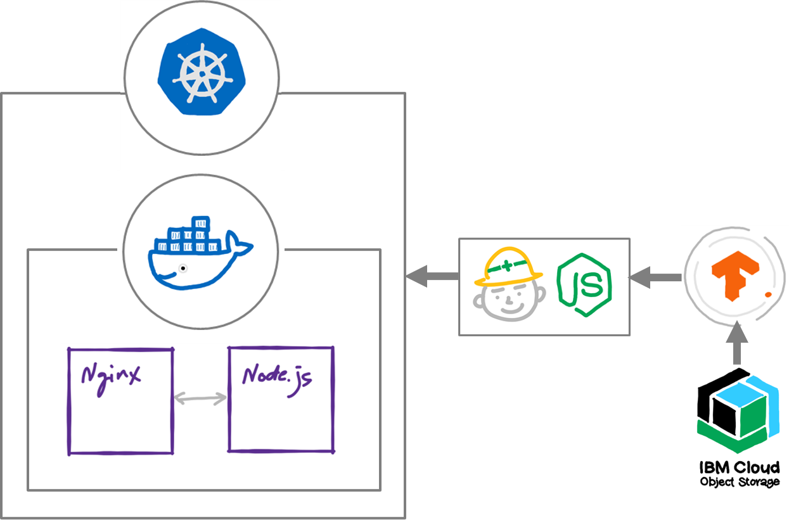

# Object Detection React App (detect hat)



You can find an in depth walkthrough for training a TensorFlow.js model [here](https://github.com/cloud-annotations/training/).


# Prerequisites
You need to have the following installed to complete the steps below:

* [Docker](https://www.docker.com/products/docker-desktop)
* [IBM Cloud Kubernetes Service Provisioned (Lite cluster)](https://www.ibm.com/cloud/container-service)

For running these services locally without Docker containers, you need:

* [Node.js v10 or later](https://nodejs.org/en/download/)
<details><summary><strong>Tip: Use Node Version Manager (nvm)</strong></summary>

> nvm is a simple bash script to manage multiple active Node.js versions.

> recommend: using `Node Version Manager (NVM)` to control the version of Node.js that you use.

> Why? The system or operating system installed Node.js version is fixed. You may need different versions of Node for other projects.  

> NVM allows you to choose and switch to the version of Node.js that suits your needs.

> Install via command line:

```sh
curl -o- https://raw.githubusercontent.com/nvm-sh/nvm/v0.35.2/install.sh | bash
```

[Learn more about NVM](https://github.com/nvm-sh/nvm) and find the latest installation instructions.

</details>

* [Relevant Node.js packages](package.json): Use `npm install`


## Setup
`git clone` the repo and `cd` into it by running the following command:

```bash
$ git clone https://github.com/y-leaf/object-detection-react-hat.git
$ cd object-detection-react-hat
```

# Steps 

Follow these steps to set up and run this code pattern locally and on the cloud. The steps are described in detail below.

1. [Run the application locally](#1-run-the-application-locally)
2. [Create Self-Signed SSL Certificate for nginx container](#2-create-self-signed-ssl-certificate-for-nginx-container)
3. [Build a docker image, then run it locally usign docker-compose](#3-Build-a-docker-image-then-run-it-locally-using-docker-compose)
4. [Deploy to IBM Cloud Kubernetes Service](#4-deploy-to-ibm-cloud-kubernetes-service)


--------------------

### 1. Run the application locally

1. Install packages with NPM by running `npm install`.

> **Note: You’ll need to have Node 8.10.0 or later on your local development machine.** You can use [nvm](https://github.com/creationix/nvm#installation) (macOS/Linux) or [nvm-windows](https://github.com/coreybutler/nvm-windows#node-version-manager-nvm-for-windows) to easily switch Node versions between different projects.

2. (Optional) Add TensorFlow.js Model to the App

if you have your own TensorFlow.js model, copy the `model_web` directory generated from the object detection walkthrough and paste it into the `public` folder of this repo.

3. Start the app by running `npm start`.

4. Open [http://localhost:3000](http://localhost:3000) to view it in the browser.


--------------------

### 2. Create Self-Signed SSL Certificate for nginx container
Since this app requires to access to the client's PC camera, you need to create self-signed SSL for secure connection.

While setting up a SSL certificate, a private key and a Certificate Signing Request (CSR) must be generated to pass information between the Certificate Authority and web host. Once the CSR has been created it will generate a Certificate (CRT).

1. Preparation

# < Install OpenSSL >
Confirm if you have already installed

```bash
openssl --version
```

if you haven't, install it by:

```bash
sudo yum install -y openssl
```

# <Create a directory for SSL>

```bash
cd ./nginx
mkdir ssl
cd ssl
```

2. Creat Private Key

```bash
openssl genrsa -out server.key 3072
```

3. Create CSR (Certificate Signing Request)

```bash
openssl req -new -key server.key -out server.csr
```

You will be asked to input several information such as Contry Name and Organization name, you can simply skip them by typing 'Enter'.

4. Generate CRT (Certification)

```bash
openssl x509 -days 3650 -req -signkey server.key -in server.csr -out server.crt
```

# Congratulations! Now you have Self-Signed SSL Certificate for nginx container.


--------------------

### 3. Build a docker image, then run it locally using docker-compose

1. Make sure you are at the root of this application.

2. Note your docker-hub username
<details><summary><strong>How to find your docker hub credentials</strong></summary>

> To download Docker desktop you must create a Docker hub account.

> To find the username, you can click on at your Docker desktop icon (mac) toolbar 

</details>

3. Build the docker image by running:

```bash
export DOCKERHUB_USERNAME=<your-dockerhub-username>
docker-compose build
docker-compose up -d
```

Great!  So, now you should now see the object-detection microservice up and running

Explore the microservice at
>  [https://localhost](https://localhost)


--------------------

### 4. Deploy to IBM Cloud Kubernetes Service

1. Provision an [IBM Cloud Kubernetes Service](https://cloud.ibm.com/kubernetes/catalog/cluster).

* Login to the IBM Cloud using the [Developer Tools CLI](https://www.ibm.com/cloud/cli):
> NOTE use `--sso` if you have a single sign on account, or delete for username/password login

```bash
ibmcloud login --sso
```

* Set the Kubernetes environment to work with your cluster:

```bash
ibmcloud cs cluster-config --cluster <$CLUSTER_NAME OR $CLUSTER_ID>
```


2. Edit 'object-detection-deploy.yaml'

* Run `bx cs workers --cluster <$CLUSTER_NAME>` and locate and take note of the `Public IP`. This IP is used to access the currency service API. 

Update the `env` values `HOST_IP` in line #15 of [object-detection-deploy.yaml](object-detection-deploy.yaml)
to the `<PUBLIC_IP>`.

* Run `docker images` and confirm you have two images for this app, note your images' names.

Update the `containers` values `name`in line #9, 18 of [object-detection-deploy.yaml](object-detection-deploy.yaml)
to the `<IMAGE_NAME:TAG>`.

> NOTE change images' names to pull the images to the kubernetes clusters if the images don't have the specified user name.

```bash
dokcer tag <IMAGE_ID> <USER_NAME>/<IMAGE_NAME:TAG>
```


4. To deploy the services to the IBM Cloud Kubernetes Service, run:

```bash
kubectl create -f object-detection-nginx.yaml
kubectl apply -f object-detection-nginx.yaml

## Confirm the services are running - this may take a minute
kubectl get pods

## Expose the pod using NodePprt
kubectl expose pod object-detection --type=NodePort --port=80

## Define the NodePort number 
kubectl describe service object-detection
```

5. Use `https://<PUBLIC_IP>:<NODEPORT_NUMBER>` to access the microservice